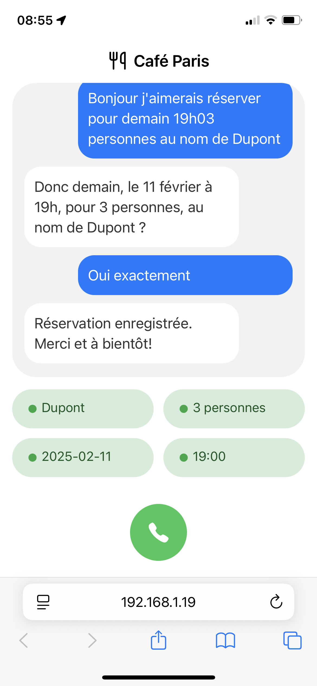

# Café Paris – Voice Booking Assistant

A full-stack web application that lets users make restaurant reservations using voice commands, powered by conversational AI (Gemini API). This project demonstrates my ability as a data scientist to learn new technologies, integrate AI, and deliver production-ready solutions.

---

## 🚀 Demo

[Live Demo](https://booking-ai-agent.onrender.com)  
<!-- Replace with your actual live URL -->
)
<!-- Add a real screenshot or GIF of the UI here -->

---

## ✨ Features

- **Voice Interaction:** Users can book a table using speech recognition and synthesis (browser-based).
- **Conversational AI:** Integrates with Gemini API for natural language understanding and dialogue.
- **Live Entity Extraction:** Automatically parses and displays booking details (name, date, time, party size).
- **Modern UI:** Responsive, accessible, and mobile-friendly interface.
- **Extensible Backend:** Node.js/Express server with clear API endpoints.
- **Configurable Prompts:** Easily update system prompts and greetings.

---

## 🛠️ Tech Stack

- **Frontend:** HTML, CSS, JavaScript (vanilla), Web Speech API
- **Backend:** Node.js, Express
- **AI Integration:** Gemini API (Google Generative Language)
- **Other:** dotenv, body-parser, CORS

---

## 📦 Setup & Usage

1. **Clone the repository**
   ```bash
   git clone https://github.com/yourusername/booking_ai_agent.git
   cd booking_ai_agent
   ```

2. **Install dependencies**
   ```bash
   npm install
   ```

3. **Configure environment variables**
   - Create a `.env` file with your Gemini API key:
     ```
     GEMINI_API_KEY=your_api_key_here
     ```

4. **Run the server**
   ```bash
   node server.js
   ```
   The app will be available at [http://localhost:5050](http://localhost:5050).

---

## 🖼️ Architecture

```mermaid
graph TD
    A[User (Browser)] -- Voice/Text --> B[Frontend JS]
    B -- REST API --> C[Express Server]
    C -- API Call --> D[Gemini API]
    C -- Static Files --> B
    C -- Config Files --> B
```

---

## 📊 Data Science Extensions

- **Data Analysis:** Add scripts/notebooks to analyze booking data (trends, peak hours, user behavior).
- **Anomaly Detection:** Detect unusual booking patterns or fraudulent activity.
- **Recommendation Engine:** Suggest optimal booking times based on historical data.
- **Visualization:** Integrate dashboards (e.g., with Plotly, D3.js, or Python notebooks).

---

## 🧑‍💻 Learning Outcomes

- Built a production-ready web app from scratch.
- Integrated browser APIs (Speech Recognition/Synthesis) and external AI services.
- Designed a modular, extensible backend.
- Explored full-stack development beyond data science.

---

## 📝 Future Improvements

- Add database support (e.g., MongoDB, PostgreSQL) for persistent bookings.
- Add automated tests and CI/CD.
- Enhance accessibility and add multi-language support.
- Integrate a Python microservice for advanced analytics.

---

## 📚 About Me

I am a data scientist passionate about building real-world AI products and learning new technologies. This project demonstrates my ability to bridge data science and software engineering.

---

## 📄 License

MIT License
